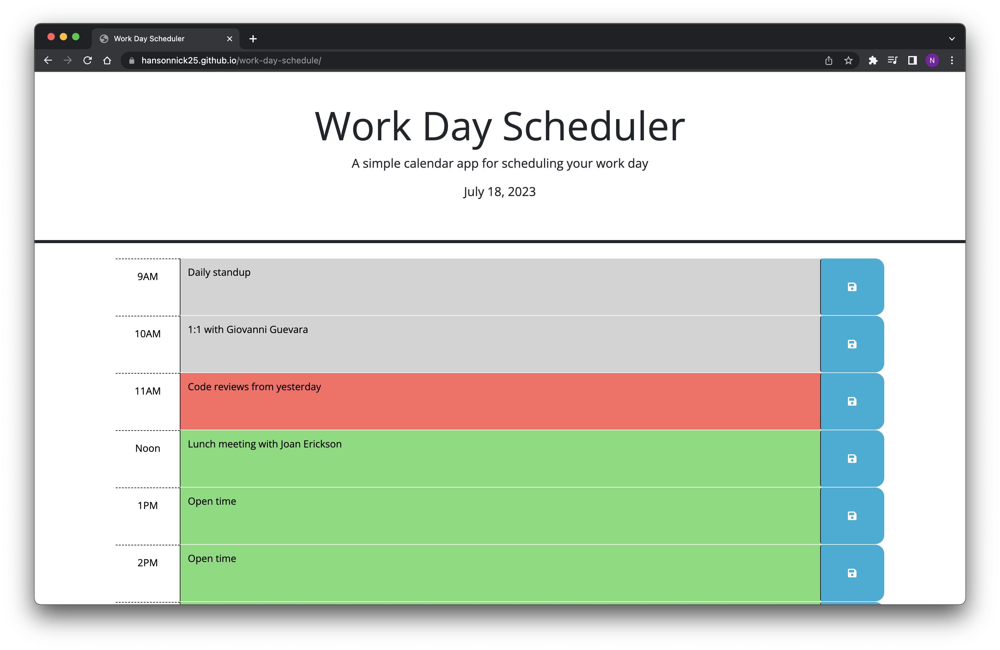
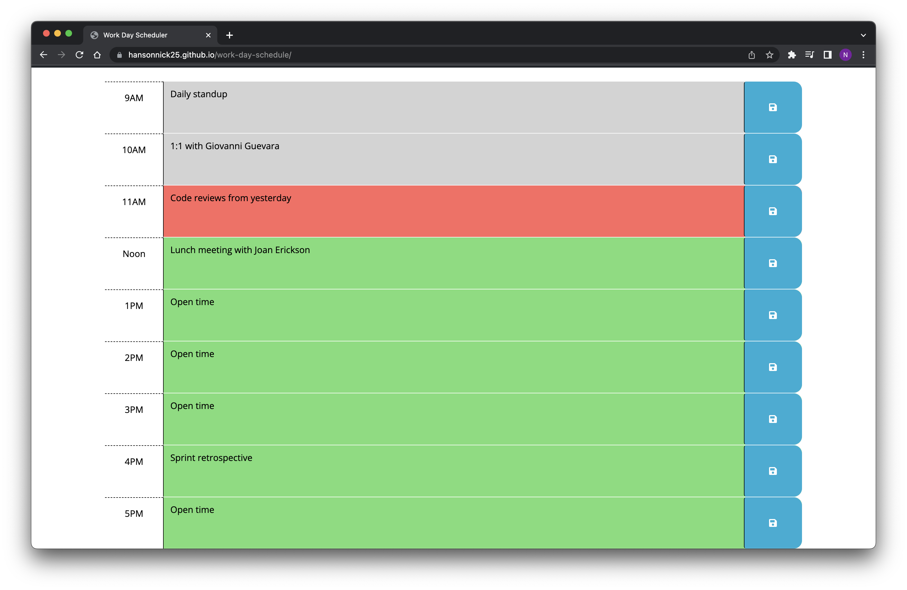

# Work Day Schedule

Work Day Schedule is a tool that will let you save items in hourly blocks for your current workday

## Description

Work Day Schedule uses the DayJS library to determine current hour, change the colors of time blocks based on that

## Technologies

Work Day Schedule uses the following libraries:

- DayJS
- BootStrap
- JQuery
- Google Fonts
- Font Awesome

## Contributing

README template borrowed from [Make a README](https://www.makeareadme.com/)

## License

[MIT](https://choosealicense.com/licenses/mit/)

## Screenshots

